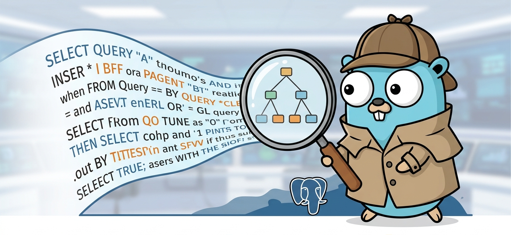

# pgwatch



A PostgreSQL slow query watcher and advisor daemon. It tails your PostgreSQL log file, parses `auto_explain` output, and reports actionable findings using [pgexplain](https://github.com/bright98/pgexplain) as the rule engine.

```
PostgreSQL log file
      │
      ▼
pgwatch  ←─── tails & parses auto_explain JSON blocks
      │
      ▼
pgexplain rule engine  ←─── 8 built-in rules (seq scan, row estimate mismatch, sort spill, …)
      │
      ▼
terminal / JSON / HTML report
```

No database connection is required. pgwatch is a pure log reader — it never executes `EXPLAIN` itself.

---

## Rule engine: pgexplain

pgwatch delegates all plan analysis to [pgexplain](https://github.com/bright98/pgexplain), a standalone Go library I wrote as a companion to this project. It provides a parser and an advisor with 8 built-in rules:

| Rule | What it catches |
|------|----------------|
| `SeqScan` | Large sequential scans on big tables |
| `RowEstimateMismatch` | Planner estimates off by 10× or more |
| `HashJoinSpill` | Hash joins that spill to disk |
| `NestedLoopLarge` | Nested loops with large outer input |
| `MissingIndexOnlyScan` | Heap fetches defeating an index-only scan |
| `SortSpill` | Sort operations that spill to disk |
| `TopNHeapsort` | LIMIT queries using slow heapsort |
| `ParallelNotLaunched` | Parallel plans where workers never started |

All rules require `EXPLAIN (ANALYZE, FORMAT JSON)` output — which is exactly what `auto_explain` provides.

---

## Prerequisites

- PostgreSQL 14 or later
- `auto_explain` extension enabled (ships with PostgreSQL, no separate install needed)
- Go 1.24 or later (only needed to build from source)

---

## Setting up auto_explain

`auto_explain` hooks into every query execution and writes a full `EXPLAIN ANALYZE` plan to the PostgreSQL log. pgwatch reads those plans directly.

Add the following to `postgresql.conf` and restart (or reload for the GUC-level settings):

```ini
# Load auto_explain at startup — requires a restart
shared_preload_libraries = 'auto_explain'

# Log queries slower than this threshold (milliseconds).
# See the section below for guidance on picking the right value.
auto_explain.log_min_duration = 1000

# Must be json — pgwatch cannot parse text or xml plans.
auto_explain.log_format = json

# Must be on — pgexplain rules require actual row counts and timing.
auto_explain.log_analyze = on

# Include the user and database in the log prefix so pgwatch can attribute each plan.
# This exact format is required.
log_line_prefix = '%m [%p] %q%u@%d '
```

Verify it is working by running a slow query and checking your log file:

```bash
tail -f /var/log/postgresql/postgresql-17-main.log | grep "duration:"
```

You should see lines like:

```
2026-05-10 14:23:01.887 UTC [8821] myuser@mydb LOG:  duration: 1243.821 ms  plan:
[
  {
    "Plan": { "Node Type": "Hash Join", "Actual Rows": 923847, ... },
    "Execution Time": 1243.821
  }
]
```

### Choosing log_min_duration

`auto_explain.log_min_duration` is the most important setting. It controls which queries appear in the log — and therefore which queries pgwatch analyzes.

**Setting it too low** logs every query, including fast ones. On a busy server this floods your log file (and disk I/O), produces noise in pgwatch reports, and obscures the real offenders.

**Setting it too high** misses medium-slow queries that accumulate cost at scale.

Practical starting points:

| Environment | Recommended value | Rationale |
|-------------|------------------|-----------|
| Production (busy) | `1000` ms | Only logs genuine outliers; minimal log overhead |
| Production (moderate) | `500` ms | Good coverage without flood risk |
| Staging / QA | `100` ms | Catch regressions before they reach production |
| Local development | `0` ms | Log everything — useful for one-off audits with `pgwatch report` |

Start at 1000 ms in production and lower the threshold once you understand the log volume. You can always run `pgwatch report` on a staging server with a lower threshold to do a deeper audit without touching production logs.

> **Note:** `auto_explain.log_min_duration = -1` disables auto_explain entirely. `0` logs every query.

---

## Installation

```bash
go install github.com/bright98/pgwatch/cmd/pgwatch@latest
```

Or clone and build:

```bash
git clone https://github.com/bright98/pgwatch
cd pgwatch
go build -o pgwatch ./cmd/pgwatch
```

---

## Quick start

Copy the example config and edit the `log_file` path:

```bash
cp pgwatch.example.yaml pgwatch.yaml
# edit pgwatch.yaml — set log_file to your PostgreSQL log path
```

**Daemon mode** — tail the log continuously, flush a report every hour:

```bash
pgwatch run -c pgwatch.yaml
```

**One-shot mode** — read the log from the beginning, report once, and exit:

```bash
pgwatch report -c pgwatch.yaml
```

**Dry run** — parse and analyze without writing any output (useful for testing config):

```bash
pgwatch report --dry-run -c pgwatch.yaml
```

---

## Output formats

### Terminal (default)

```
=== pgwatch report — Wed, 13 May 2026 14:00:00 UTC ===

#1  2026-05-10 14:23:01 UTC  myuser@mydb  duration=1243.82ms  [auto_explain]
    [ERROR] node=1 (Hash Join) — hash batch spill to disk
             Inner side wrote 42 MB to temp files across 8 batches.
             → Increase work_mem or reduce the join input size.
```

### JSON

```yaml
output: json
out_file: /tmp/pgwatch-report.json
```

Produces a structured JSON file with all plans and findings. Suitable for dashboards, alerting pipelines, or post-processing.

### HTML

```yaml
output: html
out_file: /tmp/pgwatch-report.html
```

Produces a self-contained HTML file with no external dependencies. Open it in any browser — includes collapsible plan JSON and color-coded severity badges.

---

## Config reference

| Field | Type | Default | Description |
|-------|------|---------|-------------|
| `source` | string | `auto_explain` | Plan source. Only `auto_explain` is supported. |
| `log_file` | string | — | **Required.** Path to the PostgreSQL log file. |
| `interval` | duration | `1h` | How often findings are flushed to the reporter (daemon mode). |
| `max_buffered_plans` | int | `1000` | Max plans held in memory before an early flush. Protects against unbounded growth during traffic spikes. |
| `output` | string | `terminal` | Report format: `terminal`, `json`, or `html`. |
| `out_file` | string | — | Required when `output` is `json` or `html`. |

Duration strings follow Go's format: `30m`, `1h`, `6h`, `24h`.

---

## License

MIT
